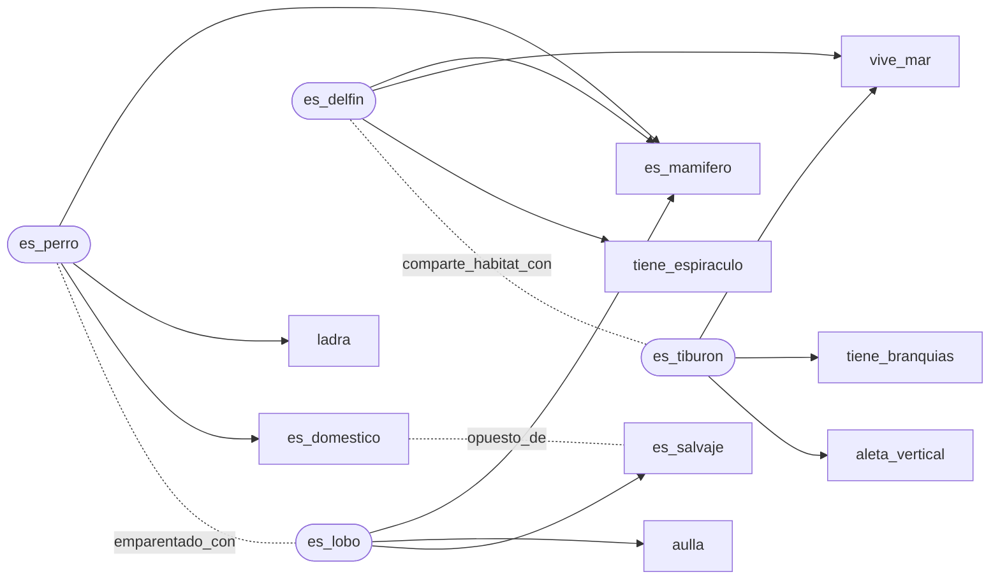

```mermaid
graph LR
    perro([es_perro])
    lobo([es_lobo])
    delfin([es_delfin])
    tiburon([es_tiburon])

    mamifero[es_mamifero]
    ladra[ladra]
    domestico[es_domestico]
    aulla[aulla]
    salvaje[es_salvaje]
    mar[vive_mar]
    espiraculo[tiene_espiraculo]
    branquias[tiene_branquias]
    aleta[aleta_vertical]

    perro --> mamifero
    perro --> ladra
    perro --> domestico

    lobo --> mamifero
    lobo --> aulla
    lobo --> salvaje

    delfin --> mamifero
    delfin --> mar
    delfin --> espiraculo

    tiburon --> mar
    tiburon --> branquias
    tiburon --> aleta

    domestico -. opuesto_de .- salvaje
    perro -. emparentado_con .- lobo
    delfin -. comparte_habitat_con .- tiburon
```
